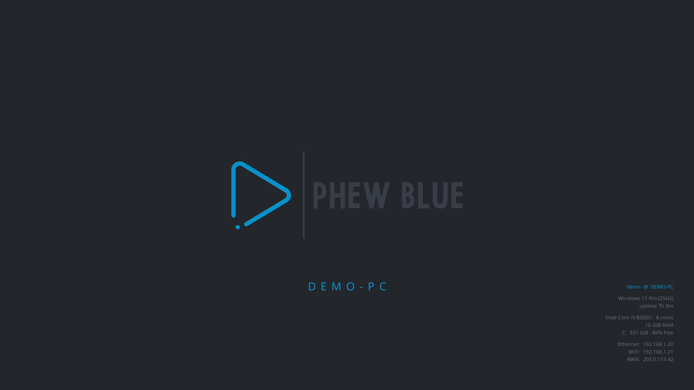

# wallpaper-info

Composites a small system-info panel (and an optional centered label) onto a background image and
sets it as the Windows desktop wallpaper. Self-contained single binary — the font is loaded from the
system (Open Sans if installed, else Segoe UI) and the background defaults to your current wallpaper,
so it runs anywhere with no assets. Shows **specs, not live usage**.

The info block shows `user @ host`, OS, uptime, CPU (model + cores), RAM (total), disk (total),
per-NIC LAN IPs and the WAN IP. Which rows appear and which corner they sit in are configurable
(bottom-right by default), as is an optional centered label (defaults to the hostname).



## Install (Windows)

Download the installer from **<https://phew.blue/software>** (or the [latest release](https://github.com/phew-blue/wallpaper-info/releases/latest)) and run it. It is a
per-user install (no admin), adds an Add/Remove Programs entry, and registers a Startup
entry that runs `--tray`.

Unattended:

```powershell
$m = Invoke-RestMethod https://github.com/phew-blue/wallpaper-info/releases/latest/download/manifest.json
Invoke-WebRequest $m.latest.setup.url -OutFile $env:TEMP\setup.exe
& $env:TEMP\setup.exe /VERYSILENT /SUPPRESSMSGBOXES /NORESTART /PRESET=phew-blue
```

### Tray

`--tray` runs resident with a tray icon: **Refresh now**, **Presets** (switch look),
**Check for updates**, **Open config**, **Quit**. If the tray cannot start it falls back
to a headless refresh loop rather than leaving the desktop unpainted.

### Presets

Presets are published at <https://github.com/phew-blue/wallpaper-info/releases/latest/download/manifest.json> and carry
colours, font, label rule, panel layout, and matching background images.

```powershell
./wallpaper-info.exe --list-presets
./wallpaper-info.exe --preset mono
```

A preset only fills settings you have not set yourself. Precedence is
**defaults < preset < config file < explicit flags**, so a hand-tuned machine is never
silently restyled. Presets are authored as `presets/*.toml` in this repo; tagging a
release regenerates the published manifest.

### Offline / removable media

`--manifest` also accepts a **local path**, so a provisioning USB or an air-gapped
machine needs no network at all:

```powershell
./wallpaper-info.exe --manifest E:\phew-blue\wallpaper-info\manifest.json --list-presets
./wallpaper-info.exe --manifest E:\phew-blue\wallpaper-info\manifest.json --preset timeline-blue
```

Asset URLs in a local manifest are resolved **relative to the manifest**, so the stick
works whether it mounts as `E:` or `F:`. Backgrounds are copied into the local cache
rather than referenced in place, so the wallpaper keeps rendering once the stick is
removed. Build one with `go run ./tools/manifest -local ...`.

Everything about presets degrades safely: if the manifest is unreachable, the last
cached copy is used, then local config. A network failure never fails a render.

## Build / run

```powershell
go build -o wallpaper-info.exe .
./wallpaper-info.exe            # composite onto current wallpaper, set it
go test ./...                   # manifest, presets, config precedence, layout, version compare
```

Non-Windows builds exist so development works anywhere, but off Windows only `--out` does
anything useful — there is no wallpaper to set, no tray, and no self-update.

## Customisation

Settings live in a **TOML config file**; flags override it for one-offs.

```
Windows : %APPDATA%\wallpaper-info\config.toml
macOS   : ~/.config/wallpaper-info/config.toml   (or $XDG_CONFIG_HOME)
Linux   : ~/.config/wallpaper-info/config.toml
```

Create one with your current settings, then edit it:
```powershell
./wallpaper-info.exe --name STUDIO-PC --accent "#40c4ff" --write-config
```
See `config.example.toml` for the keys. The config can also live in your dotfiles repo and be
symlinked here so it syncs across machines. `--config <path>` points at a specific file.

### Flags (override the config)

| Flag | Default | Meaning |
|---|---|---|
| `--base <png/jpg>` | current desktop wallpaper | background to draw onto (else a solid brand-dark canvas) |
| `--name <text>` | hostname | centered label; `-` to hide |
| `--font <name\|path>` | Open Sans → Segoe UI | font family (in Windows\Fonts) or a `.ttf` path |
| `--accent <hex>` | `#0092CA` | colour of `user @ host` |
| `--secondary <hex>` | `#6A7078` | colour of the detail lines |
| `--out <png>` | (unset) | write a preview PNG instead of setting the wallpaper |
| `--watch <minutes>` | `0` | re-render every N minutes (else run once) |
| `--config <path>` | per-OS config dir | use a specific config file |
| `--write-config` | — | save the current effective settings to the config file and exit |
| `--tray` | — | run resident with a tray icon (Windows); implies the watch loop |
| `--preset <id>` | (unset) | apply a published preset |
| `--list-presets` | — | list the presets in the manifest and exit |
| `--manifest <url>` | `https://github.com/phew-blue/wallpaper-info/releases/latest/download/manifest.json` | use a different manifest |
| `--update` | — | install the latest release (Windows) and exit |
| `--version` | — | print the version and exit |
| `--demo` | — | render synthetic sample data (used for `docs/preview.png`) |

Examples:
```powershell
./wallpaper-info.exe --out preview.png                          # preview, don't touch wallpaper
./wallpaper-info.exe --base "C:\path\bg.jpg" --name STUDIO-PC   # custom bg + label
./wallpaper-info.exe --accent "#40c4ff" --font "Cascadia Code"  # recolour + refont
./wallpaper-info.exe --watch 30                                 # keep IP/uptime fresh
```

Defaults are phew-blue branding; everything is overridable.

## Regenerating the preview

`docs/preview.png` **must** be rendered with `--demo`, which substitutes synthetic facts
(`DEMO-PC`, documentation-range addresses). Rendering it from a real machine would publish that
machine's hostname, LAN topology, and WAN IP.

```bash
./wallpaper-info --demo --name DEMO-PC \
  --base ../brand/assets/wallpapers/logo/png/1920x1080/phew-blue-wallpaper.png \
  --font /path/to/OpenSans-Regular.ttf \
  --out docs/preview.png
```
